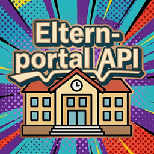

# ElternPortal API for Home Assistant

[](https://github.com/workFLOw42/ha-elternportal/releases)
[](LICENSE)
[](https://github.com/hacs/integration)



A Home Assistant custom integration for [ElternPortal](https://eltern-portal.org) – the school communication platform used by many German schools.

Based on the concepts of the [elternportal-api](https://github.com/philippdormann/elternportal-api) by Philipp Dormann.

---

## Features

| Sensor | State | Attributes |
|--------|-------|------------|
| **Elternbriefe** | Number of letters | Full list of letters (title, date, link) |
| **Schwarzes Brett** | Number of entries | Blackboard entries (title, content, date) |
| **Termine** | Number of appointments | Appointments (title, date, details) |
| **Nachrichten** | Number of messages | Messages (subject, sender, date) |
| **Vertretungsplan** | Number of entries | Substitution plan rows |
| **Stundenplan** | Number of rows | Timetable data |
| **Kinder** | Number of children | Children information |

> **Manual fetch only** – Data is fetched exclusively via the `elternportal.fetch_data` service.
> No automatic polling. Trigger it from an automation, script, or the Developer Tools.

---

## Configuration

1. Go to **Settings → Devices & Services → Add Integration**
2. Search for **ElternPortal API**
3. Enter your credentials:
   - **School Slug** – subdomain of your school, e.g. `gymnasium-musterstadt` from `gymnasium-musterstadt.eltern-portal.org`
   - **Username** – your email address
   - **Password** – your password

---

## Service

### `elternportal.fetch_data`

Fetches all data from ElternPortal and updates every sensor.

```yaml
service: elternportal.fetch_data
data: {}
```

---

## Example Automation

```yaml
automation:
  - alias: "ElternPortal – Daten abrufen"
    trigger:
      - platform: time_pattern
        hours: "/2"
    action:
      - service: elternportal.fetch_data

  - alias: "ElternPortal – Neue Elternbriefe"
    trigger:
      - platform: state
        entity_id: sensor.elternportal_elternbriefe
    condition:
      - condition: template
        value_template: >
          {{ trigger.to_state.state | int(0) > trigger.from_state.state | int(0) }}
    action:
      - service: notify.mobile_app
        data:
          title: "Neuer Elternbrief"
          message: >
            Es gibt {{ trigger.to_state.state }} Elternbriefe.

  - alias: "ElternPortal – Vertretungsplan"
    trigger:
      - platform: state
        entity_id: sensor.elternportal_vertretungsplan
    condition:
      - condition: template
        value_template: "{{ trigger.to_state.state | int(0) > 0 }}"
    action:
      - service: notify.mobile_app
        data:
          title: "Vertretungsplan"
          message: >
            {{ trigger.to_state.state }} Einträge im Vertretungsplan.
```

---

## Troubleshooting

| Problem | Solution |
|---------|----------|
| Login fails | Verify the school slug matches the URL of your school's ElternPortal |
| No data after setup | Call `elternportal.fetch_data` – there is no automatic polling |
| Sensor shows 0 | Some schools don't use all features |
| Parsing issues | HTML structure may vary per school – open an issue with details |

---

## Credits

- [elternportal-api](https://github.com/philippdormann/elternportal-api) by Philipp Dormann
- Inspired by [DSB_Mobile_Api](https://github.com/workFLOw42/DSB_Mobile_Api) and [ha-deutsche-ferien](https://github.com/workFLOw42/ha-deutsche-ferien)